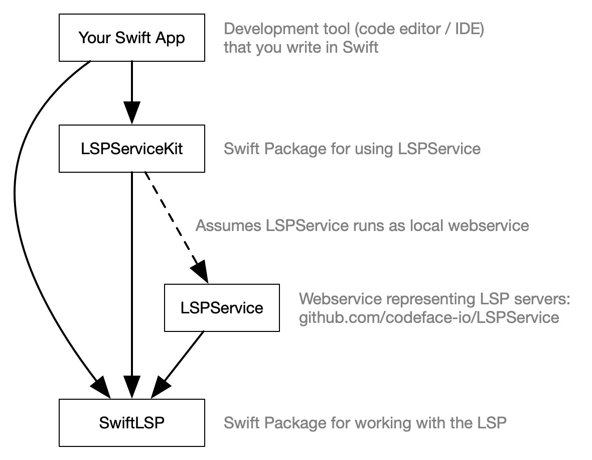

# LSPServiceKit

A package that helps Swift clients use [LSPService](https://github.com/codeface-io/LSPService).

## Context

LSPServiceKit contains a type named `LSPService` that mirrors the [web API of LSPService](https://github.com/codeface-io/LSPService#api). For example, it lets you write `LSPService.api.language("python").connectToLSPServer()` which translates to a websocket connection request on `http://127.0.0.1:8080/lspservice/api/language/python/websocket`.

## Codebase

Here is the internal architecture (composition and essential dependencies) of the codebase:

The above image was generated with the [Codeface.io](https://www.codeface.io) app.