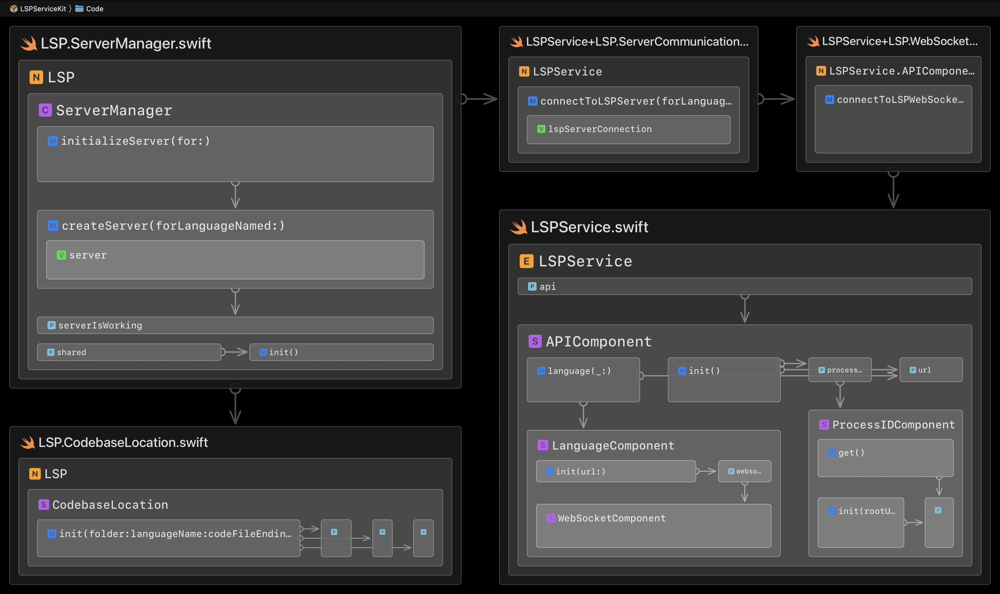

# LSPServiceKit

[](https://swiftpackageindex.com/codeface-io/LSPServiceKit) &nbsp;[](https://swiftpackageindex.com/codeface-io/LSPServiceKit) &nbsp;[](https://swiftpackageindex.com/codeface-io/LSPServiceKit/documentation) &nbsp;[](LICENSE)

👩🏻‍🚀 *This project [is still a tad experimental](#development-status). Contributors and pioneers welcome!*

## What?

LSPServiceKit helps Swift apps use [LSPService](https://github.com/codeface-io/LSPService):


## How?

### Get an LSP Server

`LSPService` precisely reflects the LSPService API, so the first call here translates to a websocket connection request on `http://127.0.0.1:8080/lspservice/api/language/Swift/websocket`:

```swift
// Connect to Swift LSP websocket
let webSocketConnection = try LSPService.api.language("Swift").websocket.connectToLSPWebSocket()

// Create "server" with websocket connection
let server = LSP.Server(connection: webSocketConnection, languageName: "Swift")
```

Or quicker:

```swift
let server = try LSPService.connectToLSPServer(forLanguageNamed: "Swift")
```

Now, you'd probably wanna set the server's three handlers:

```swift
await server.handleNotificationFromServer { notification in
    // handle notification
}
            
await server.handleErrorOutputFromServer { errorOutput in
    // handle errorOutput
}

await server.handleConnectionShutdown { error in
    // handle error
}
```

### Initialize an LSP Server

```swift
// Get the process ID of LSPService
let processID = try await LSPService.api.processID.get()

// Initialize server with codebase folder
_ = try await server.request(.initialize(folder: codebaseFolderURL, 
                                         clientProcessID: processID))

// Notify server that we are initialized
try await server.notify(.initialized)
```

### Use LSP.ServerManager

All the above can be achieved quicker:

```swift
// Locate the codebase
let codebase = LSP.CodebaseLocation(folder: codebaseFolderURL,
                                    languageName: "Swift",
                                    codeFileEndings: ["swift"])

// Create and initialize the LSP server
let server = try await LSP.ServerManager.shared.initializeServer(for: codebase)
```

## Architecture

Here is the internal architecture (composition and essential dependencies) of the code folder:



The above image was generated with the [Codeface](https://codeface.io) app.

## Development Status

From version/tag 0.1.0 on, LSPServiceKit adheres to [semantic versioning](https://semver.org). So until it has reached 1.0.0, its API may still break frequently, but this will be expressed in version bumps.

LSPServiceKit is already being used in production, but [Codeface](https://codeface.io) is still its primary client. LSPServiceKit will move to version 1.0.0 as soon as its basic practicality and conceptual soundness have been validated by serving multiple real-world clients.